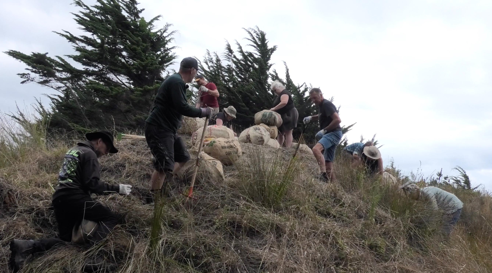
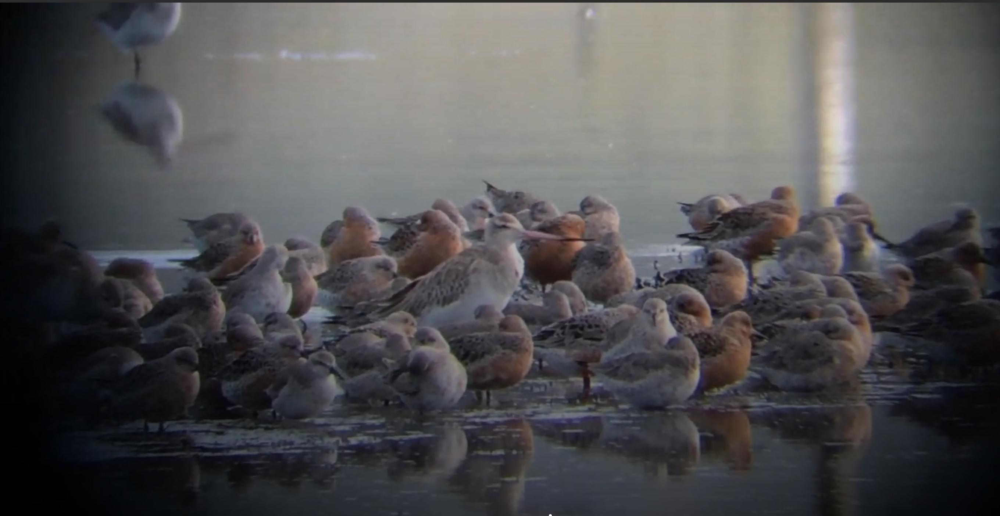

_Where we are_ // 18 July - 2 August 
Curated by Sophie Jerram 

## _Whakahokia_ (2025), Mark Harvey, 13:55

_Whakahokia_ was a beachside restoration and performance event at Kuku beach, on
Sat 8th March, 2025.  Participants removed invasive maram grass off a beach
dune and returned it to State Highway 1, 7km away.

Curated by Huhana Smith, as part of Te Waituhi ā Nuku: Drawing Ecologies.With
thanks to Ngāti Tukorehe iwi. Camera: Maija Stephens; Editing: Mark Harvey.

**Mark Harvey** is an artist working in performance and video. His practice
tests out notions of endurance with constructions of idiocy, seriousness and
deadpan humour, and draw from his visual arts and contemporary dance
influences, in addition to ecology, social justice, te Tiriti and mātauranga
Māori. He has presented in a range of contexts including Letting Space, NZ
festival of the Arts, the Venice Biennale, and the Pain in the Class video art
festival in Estonia.
 

## _Thronging in Three Parts_ (2025), Trudy Lane, 8:33

Filmed at the Robert Findlay Wildlife Reserve, Pūkorokoro, North Waikato Each
year, thousands of migratory shorebirds arrive at Pūkorokoro Miranda from as
far away as Alaska and Siberia to feed on the rich intertidal mudflats. Living
by the rhythm of the tides, they move closer as the water rises and retreat
across the flats as it recedes. Joining them in this tidal cycle is the
dedicated team at the Pūkorokoro Shorebird Centre, who care for these birds in
their southern habitat and advocate for them across the globe. _Thronging in
Three Parts_ is a meditation on these cyclical timeframes, composed from found
footage captured by staff and volunteers while working at the Reserve — Chelsea
Ralls, Trudy Lane, and 賴怡蒨 Emilia Lai.

Shorebirds visible in the work: Kuaka / Bar-tailed Godwit, Huahou / Red Knot,
Poaka / Pied Stilt, Ngutu Parore / Wrybill, Tōrea / South Island Pied
Oystercatcher, Tarāpuka / Black-billed Gull, Kōtuku Ngutupapa / Royal
Spoonbill, Matuku Moana / White-faced Heron, Turnstone, White-fronted Tern,
Taranu / Caspian Tern, Tōrea Pango / Variable Oystercatcher.

**Trudy Lane** is a cultural producer and creator working at the intersection of
science, art, and community. She co-chairs Intercreate.org and is interested in
poetic-pragmatic approaches through which creativity can directly support local
ecologies — deepening our relationships with place, with each other, and across
the complex social and historical layers we inhabit.
 

## _Ghosts_ (2018), Misagh Azimi, 13:33

**_Ghosts_** explores the sonic response of a space to the composer’s music in the
immediacy of the present. Originally composed in 2018 for the die digitale
festival at Kunstraum Düsseldorf, the piece was composed to accompany
contemporary dance and visual art. Through a slow, morphing development, _Ghosts_
meditates on themes of time – bridging past and future. At moments it demands
the listener’s full attention; at others, it invites introspection, drifting,
and a heightened awareness of the surrounding space. In this shifting dynamic,
the work summons the “ghosts” that linger – memories, anticipations, and echoes
of what was and what might be.

[**Misagh Azimi**](/collaborators/misagh) is a composer, researcher, and interdisciplinary artist based in
Aotearoa New Zealand. His compositional work centers on music for the stage and
visual media. In his research, he explores the creative potential of artificial
intelligence, the development of new technologies for music-making, and a
critical engagement with the role of technology in musical practice – examining
questions of labor, authorship, and technofeudalism. 

