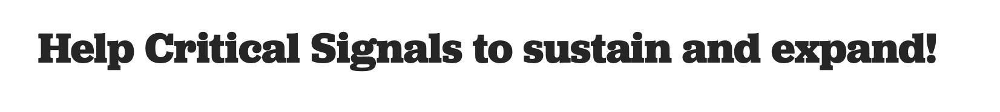

## Week Three reflection from core team collaborator Julian Oliver

It was a busy week for the data and digital infrastructure track of Critical
Signals. Offline Aotearoa!, a half-day workshop on digital infrastructure
sovereignty, led by me, Julian Oliver. Participants command line learn tools to
dig behind the surface of Aotearoa New Zealand’s digital infrastructure to find
where the services of our government and public sector are geographically and
jurisdictionally located. It is clear that many of the server we consider ‘our
own’ are in fact on privately owned datacenters far away, and often on US-owned
and controlled property. While we Aotearoa New Zealanders might think of
ourselves as politically, culturally and economically sovereign, we are very
much not so when it comes to the digital infrastructure we use everyday. Week
Three reflection from core team collaborator [Julian Oliver](/collaborators/julian/)
 
Whena Owen, from TVNZ’s Q&A spent time at Critical Signals (115 Taranaki St) to
chat about these themes, resulting in a story [airing on Sunday
morning](https://www.tvnz.co.nz/shows/q-and-a/clips/digital-activists-moving-data-out-of-trump-s-america-q-a-2025).

On Thursday a talk was held in the space introducing the post-Internet offline
communications platform Meshtastic, for which an already thriving
community-owned-and-operated network in the Lower North Island already exists.
Meshtastic is a resilient ‘mesh-networking’ technology allowing users to stay
in touch with text messages from their smartphones even in a total power and
Internet blackout. Rather than pushed as a complete ‘techno-fix’ for
disaster-tolerant communications, Meshtastic was discussed as meeting needs not
covered by traditional AM radio emergency broadcasts from authorities, rather
empowering communities to organise and meet their own needs in a crisis.
 
On Saturday, participants of this talk met to identify ‘blind spots’ in the
CBD, with a view to placing new mesh ‘nodes’ in the city to increase coverage.
From this session, several new locations for nodes were identified, with one
large blind spot found through live testing at the wharf. For this the team
proved a node at the top of Taranaki street would open up connectivity for not
just all of Taranaki street, but much of the harbour itself.

-- Julian Oliver

_Julian Oliver on TVNZ's Q+A discussing his work in infrastructure activism and the politics of digital infrastructure._

<a class='newsletter-button'
  href='https://www.1news.co.nz/2025/08/03/why-this-kiwi-good-hacker-is-keeping-data-out-of-us-hands/'>
  View Here + RNZ Story
</a>

---

## Location Identification

Our new low tech highly responsive location identification system created by
Ollie Hutton - a signal that Critical Signals is in through the glass doors
rather than the grey 115 door [that's home to our beautiful friends Supergood]
 

_**Apologies to Ed Strafford who we erroneously referred to as Ed Burn in last
weeks signal!**_

---

## Support

To support the project, we are seeking $9,000 to be able to steward the
physical space, but any further Pledges will greatly help us to get Critical
Signals up and running. Your Pledges will cover the lease of the building, and
enable the team to deliver a series of seminars and workshops.
 
The success of Critical Signals depends on community support. The space will be
a hub for learning, kōrero, and creative experimentation—offering opportunities
to simply connect or dive into hands-on activities. 
 

<a class='newsletter-button'
  href='https://www.pledgeme.co.nz/projects/8444-help-critical-signals-to-sustain-and-expand'>
  CLICK HERE
</a>

 
_Please give generously here to support the collaborators of the project to look after the space, provide sessions and help to facilitate the project!_

---

## Open Call For Recipes

Recipes for Disaster is an open exhibition and publication in progress as part
of the Critical Signals programme. 
 
_Collaboratively cooking up ceremonies of creativity in times of collapse and repair_ - Open Call for recipes!
 
We are calling for recipes of any nature; whether they are card games to play
when the power is out, a bread recipe for an open fire, or leaving the tap on
and heading to Dannevirke for a viking conference. Use of imagination is
strongly encouraged. All recipes considered. 
 
Some may be read out by the ‘Disaster Chef’ (a fictional reality tv show host).
Recipes for [use within] disaster (a bestiary of things to call upon in
emergencies) AND Recipes for disaster (things that will most certainly not end
well).
 
**Deadline for entries is August 18th**  
Email recipes to recipes@criticalsignals.nz   
OR drop into 115 Taranaki Street and write one out on paper  
OR mail physical entries to 115 Taranaki Street
 
Exhibition runs Aug 19th - Sep 5th 2025. Publication printed thereafter.

---

## Critical Signals is a hub for Coshop! 

A local food cooperative with pickup locations throughout the Wellington
Region - [click here to get your orders in by 5pm Monday](https://coshop.nz/nz)
to collect from 115 Taranaki Street on Thursday!

The food coop is managed by two nonprofits, Wesley Community Action and Te Toi
Mahana and run by volunteers. The produce comes directly from a producers
cooperative the same morning so is very fresh 🥬

---

## COMING UP...

See [Programme](/calendar/)

---

## Thank you to our sponsors and collaborating organisations

---

**Open 12pm - 7pm,** 
**Tuesday - Saturday**

