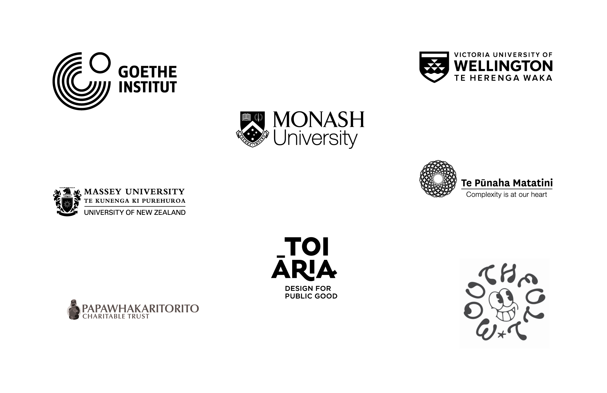

## Week Four reflection from visitor to the space Melissa Pearce - thank you!

hello from the ground up. A disaster is looming, we can all feel it in our
bones, whether its muscle memory has passed down from the epochs, or the news
cycle. It would be easy to switch off and dopamine out, but the team at
Critical Signals are trying to keep their outlooks above the horizon. With a
call to community and pooling of individual talents.
 
The pilot pop-up along Taranaki St in te Aro, Central Wellington looks like a
gallery but has multiple layers. 
 
Spearheaded by curator Sophie Jerram and supported by (today's) stewards of the
space, Helen Kirlew Smith and Ollie Hutton, Critical Signals is an incubator,
resource, events spot and landing strip for creative and politically engaged
Wellington residents, visitors and friends of the harbour city, but
particularly those with a concern about future natural disasters. And how
communities and individuals will handle them, not just logistically but
interpersonally.
 
Jerram and Kirlew Smith come to the initiative from their work on Urgent
Moments (Letting Space) series of events in vacant space. But this time it is
less about activating buildings and unorthodox locations,than fostering an
ideas hub and community venue. “It’s partly a place to harness different
people’s skills but it is also important for people who are different from each
other to be able to come together and communicate” says Jerram.
 
On a spontaneous drop in you might find a local politician, geologist, urban
planner, chef, AI developer and internet travel editor sharing homemade soup
that a volunteer has brought in. 
 
Neurodiversity finds a warm welcome while the academics in the mix add to the
unexpected connections and converse in friendly corners. Landlines for
landslides and emotional rafts for the likely tsunami, Critical Signals is in
prepping good speed.

-- _Melissa Pearce / Journalist & Writer, Sydney_

---

## Sculpt the City: Explore Risk and Resilience in Clay

[Saturday 9th August](/programme/sculpt-the-city/) led by Mairéad de Róiste

---

## TE WĀHI INSTALLATION

Emerging from Te Wahi o Papa Whakāta, a project seeded in 2022 with Tanya Ruka,
new video works are being shown from Tuesday 12th August, curated by Oliver
Hutton. He writes:

Flickering to life every Tuesday to Sunday, Noon to Nine (or there abouts), we
have a humble offering of three delectable incantations to marvel at for a
moment in time right there on the blustery streets. You could sit at the bus
stop on Taranaki St just around the corner from Vivian, or even have a little
snuggle in the Briscoes bed - bring binoculars to view through the windows and
navigate around the cars . . . [can recommend].
 
As a karakia to the space we have the timeless wonder 'Come for a walk' by
Tanya Ruka. God bless the gannets. Come feel the morning awe yourself, as a
portal, for an exclusive few days.

Then we have a poignant ever gracious blessing by a living choir from the
natural world. ‘This is a choir’ is a beautiful documentation of an
experimental performance by a High School choir and the multi-dimensional
inter-disciplinary artist Sam Hamilton. 
 
We then have the all-embracing deeply rooted gem that is the ten year
anniversary of 'Aotearoa Now' by Ryan Fielding. To round up and connect these
threads in harmony to the Critical Signals space we have an absolutely fresh
and vibrant new film work from Tanya Ruka, a modern masterpiece named
‘Roropito’ - Neuralis Kōrero AI’s creative code visualising her own whakapapa .
. . Deeply intriguing and vital.

Welcome back to the campfire of urban dreams. We are here to help light you
from the inside out on these cold winter nights. Bless you for your kind
attention and huge mihi to these life-giving warriors breathing the warmth of
wairua into moving image.  Tihei Mauri Ora. Ngā mihi nui kia koutou 
☆☆☆☆☆

---

## Support

To support the project, we are seeking $9,000 to be able to steward the
physical space, but any further Pledges will greatly help us to get Critical
Signals up and running. Your Pledges will cover the lease of the building, and
enable the team to deliver a series of seminars and workshops.

The success of Critical Signals depends on community support. The space will be
a hub for learning, kōrero, and creative experimentation—offering opportunities
to simply connect or dive into hands-on activities. 

<a class='newsletter-button'
  href='https://www.pledgeme.co.nz/projects/8444-help-critical-signals-to-sustain-and-expand'>
  CLICK HERE
</a>

_Please give generously here to support the collaborators of the project to
look after the space, provide sessions and help to facilitate the project!_

---

## Critical Signals is a hub for Coshop! 

A local food cooperative with pickup locations throughout the Wellington
Region - [click here to get your orders in by 5pm Monday
to collect from 115 Taranaki Street on Thursday](https://coshop.nz/nz)!

The food coop is managed by two nonprofits, Wesley Community Action and Te Toi
Mahana and run by volunteers. The produce comes directly from a producers
cooperative the same morning so is very fresh 🥬

---

## COMING UP...

Check out the [Calendar](/calendar/)

---

## Thank you to our sponsors and collaborating organisations

---

