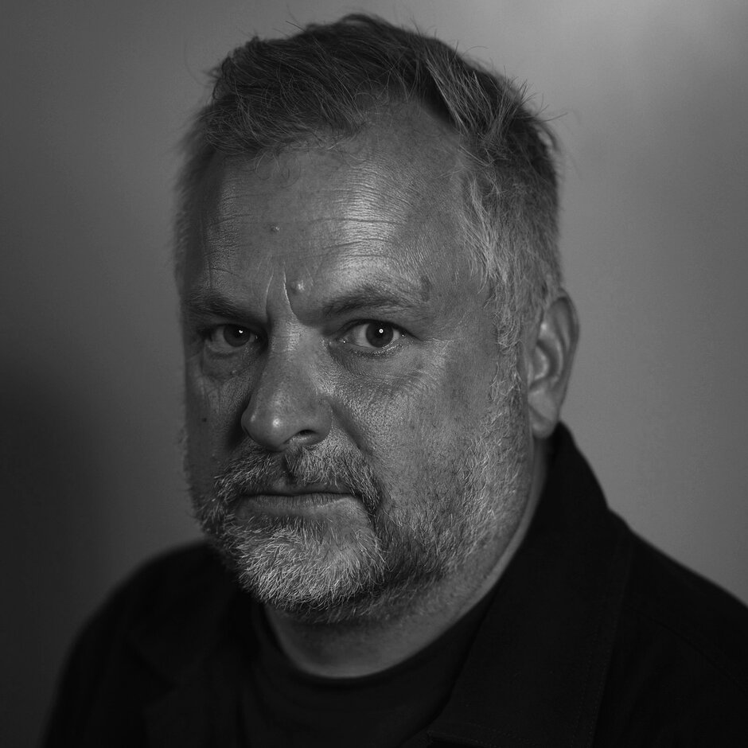




Ghost Forests is a photographic and moving image project that explores the
ecological histories hidden within New Zealand's architecture and urban
environment. It takes, for example, the relationship between Wellington's Old
Government Building — one of the world's largest surviving timber (Kauri)
buildings—and the forests that supplied its construction material. The project
seeks to reconnect architecture with its environmental origins. The
photographic prints are printed onto handmade paper containing kauri sawdust.
Ghost Forests asks visitors to consider buildings as repositories of
environmental memory. The Old Government Buildings can be understood not only
as a heritage structures but as a surviving trace of vast forests that no
longer exist. The shadow of a living kauri tree becomes both image-maker and
subject, creating photographic works that symbolically reconnect a living
forest ancestor with architecture constructed from its harvested relatives.

The exhibition is made up of 6 A3 diptych’s and 2 moving image pieces.

## About the artist

Andy Spain is a Wellington-based architectural and art photographer whose work
explores architecture, cities, landscape, and the ways people inhabit the built
environment. Originally from the UK, he has worked as a professional
photographer for more than 20 years and has been based in Aotearoa for over a
decade, working with leading architects, designers and construction companies
throughout the country. Alongside that commercial practice he develops
independent photographic and moving-image projects examining place, history and
our relationship with the landscape — *Every Building on Cuba Street*, a
photographic survey and self-published book inspired by Ed Ruscha; *Urban
Stages, Human Tapestries*, on Wellington's streets at night; *Sanctuary*, an
environmental portrait series; and *Haruru*, on tourism, photography and whenua
at Haruru Falls. His recent work increasingly investigates the environmental and
colonial histories embedded within architecture, including *Ghost Forests*.
His work has been exhibited throughout the UK and New Zealand and is held in the
collection of the Alexander Turnbull Library; Te Kāhui Whaihanga New Zealand
Institute of Architects has honoured him with a Presidents Award and the
Athfield Cup. He also hosts the podcast [Conversations with New Zealand
Photographers](https://open.spotify.com/show/5WY9MoUYg3dSoA2lbXWZ86?si=63a7ad265af44823)

[AndySpain.nz](https://andyspain.nz)
